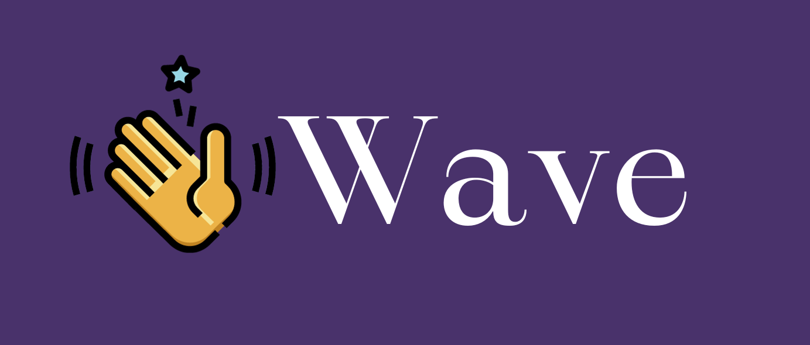
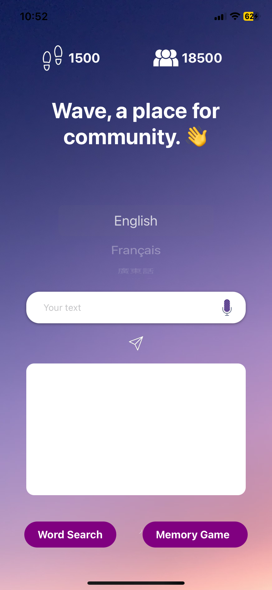
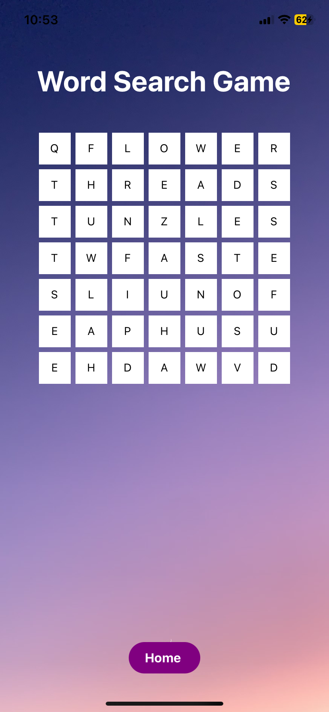
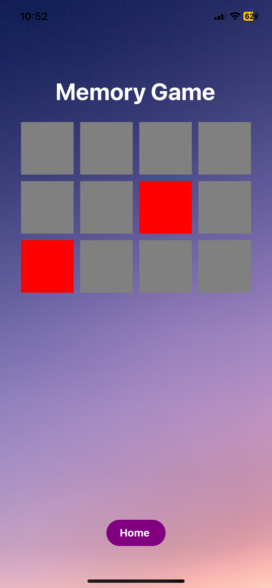

# Wave

### Welcome to Wave
The ultimate iOS app designed with seniors in mind, providing a holistic approach to well-being by fostering connections, mental stimulation, and physical activity.

### Features
Connect with Ease
Wave enables seniors to connect with like-minded individuals through language and shared interests. Our user-friendly interface ensures a seamless experience, making it easy to build connections and form lasting friendships.

### Brain Training Games
Keep your mind sharp with Wave's two engaging games:

### Word Search
Challenge yourself with classic word search puzzles designed to enhance cognitive abilities and vocabulary. Choose from various difficulty levels to tailor the experience to your preference.

### Memory Match
Exercise your memory with the timeless match-2 tiles game. Sharpen your concentration and cognitive skills while having fun with this entertaining and nostalgic game.

### Physical Health Tracking
Wave goes beyond just mental stimulation by helping you stay physically active. Track your daily steps and set goals to maintain a healthy lifestyle. Connect with friends to compare and motivate each other, turning fitness into a social experience.

### Connect and Chat
Explore a community of seniors, send friend requests, and start conversations to build meaningful connections.

### Why Wave?
Tailored for Seniors: Wave understands the unique needs of seniors and provides a user-friendly experience.

## Tech

Made using [React Native](https://reactnative.dev/) and selected libraries with the use of [Google Cloud API](https://cloud.google.com/apis) to support the active translation structure.

## Gallery

#### Project created for the 2023 University of Waterloo [Velocity's](https://velocityincubator.com/) AgeTech challenge 🧠